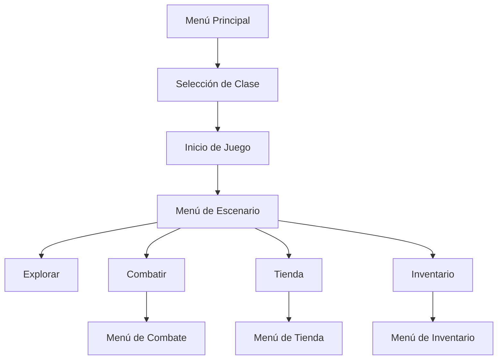
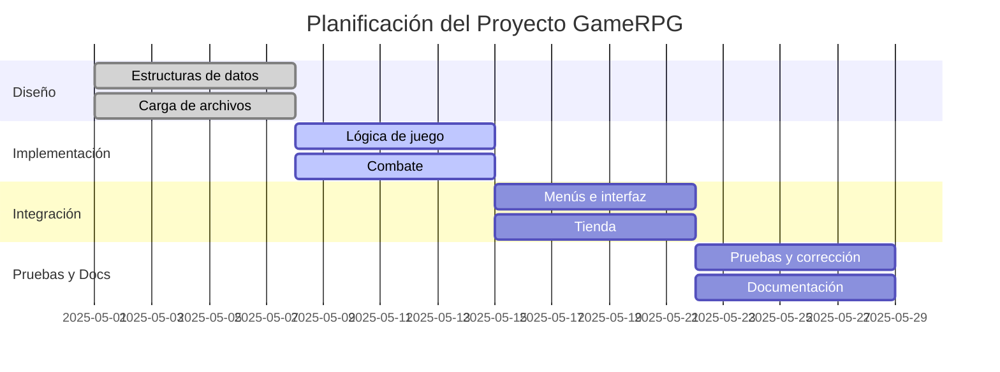

# Informe del Proyecto GameRPG

---

## 1. Introducción

En la actualidad, los videojuegos de rol (RPG) representan uno de los géneros más influyentes y apreciados tanto por jugadores como por desarrolladores. Estos juegos no solo ofrecen entretenimiento, sino que también constituyen un excelente laboratorio para el aprendizaje de conceptos fundamentales de programación, diseño de algoritmos y estructuras de datos. Sin embargo, existe un vacío en la disponibilidad de ejemplos completos y didácticos de RPGs desarrollados en C, un lenguaje que, pese a su antigüedad, sigue siendo la base de muchos sistemas y motores de juego modernos.

GameRPG surge como respuesta a esta necesidad, proponiendo una aplicación que combina la emoción de la aventura y el combate con la rigurosidad y claridad del código bien estructurado. El objetivo es doble: por un lado, brindar una experiencia lúdica y desafiante al usuario; por otro, servir como material de referencia y aprendizaje para estudiantes y entusiastas de la programación en C.

La propuesta destaca por su modularidad, la facilidad para agregar nuevos contenidos (enemigos, ítems, escenarios) y la integración de estructuras de datos abstractas (TDAs) que permiten gestionar de manera eficiente los distintos elementos del juego. Además, la aplicación fomenta la creatividad y el pensamiento lógico, invitando al usuario a tomar decisiones estratégicas que influirán en el desarrollo de la partida.

> **Fortalezas principales:**
> - Modularidad y escalabilidad.
> - Integración de TDAs y manejo de archivos externos.
> - Experiencia de usuario clara y personalizable.
> - Base sólida para proyectos educativos y de expansión.

---

## 2. Descripción de la Aplicación

GameRPG es un juego de rol por consola, donde el usuario asume el papel de un héroe que debe recorrer distintos escenarios, enfrentarse a enemigos, recolectar objetos y tomar decisiones que determinarán su destino. El flujo de juego está cuidadosamente diseñado para ofrecer una experiencia envolvente y progresiva.

### ¿Qué puede hacer la aplicación?
- Permite al usuario elegir entre diferentes clases de personaje, cada una con habilidades y atributos únicos.
- Carga escenarios, enemigos e ítems desde archivos CSV, facilitando la personalización y expansión del juego.
- Simula eventos aleatorios y combates por turnos, donde la estrategia y la gestión de recursos son clave.
- Ofrece un sistema de inventario y tienda, permitiendo al jugador comprar, vender y utilizar objetos.
- Presenta un jefe final desafiante al completar todos los escenarios.

### ¿Qué no puede hacer?
- No cuenta con gráficos ni interfaz gráfica avanzada (solo consola).
- No permite partidas multijugador ni guardado/carga de progreso.
- No incluye inteligencia artificial avanzada para enemigos.

### Menús y Submenús



- **Menú Principal:** Inicio del juego, selección de clase y explicación de reglas.
- **Menú de Escenario:** Muestra información del entorno, enemigos presentes y opciones de acción.
- **Menú de Combate:** Permite atacar, usar ítems, o intentar huir.
- **Menú de Inventario:** Visualiza, utiliza o descarta objetos.
- **Menú de Tienda:** Compra y venta de ítems según el oro disponible.

### Interacción Aplicación-Usuario

El usuario interactúa mediante entradas por teclado, eligiendo opciones numéricas o de texto. Cada acción desencadena funciones específicas, como la resolución de combates, la gestión del inventario o la compra en la tienda. El avance por los escenarios es automático tras completar los eventos de cada uno, y el juego finaliza al derrotar al jefe final o si el jugador es vencido.

> **Ejemplo de flujo de interacción:**
>
> 1. El usuario inicia el juego y elige la clase "Guerrero".
> 2. Se carga el primer escenario: "Bosque Encantado".
> 3. El jugador decide explorar y encuentra un enemigo.
> 4. Se inicia el combate, el usuario elige atacar y luego usar una poción.
> 5. Tras vencer, accede a la tienda y compra una espada mejorada.
> 6. El ciclo se repite hasta llegar al jefe final.

---

## 3. Descripción de la Solución

### Tipos de Datos y Organización

- **Player:** Estructura que almacena nombre, clase, puntos de vida, inventario y oro.
- **Enemy:** Estructura con nombre, atributos, recompensas y nivel de dificultad.
- **Item:** Estructura para objetos utilizables o equipables.
- **Scenario:** Estructura que describe el entorno, eventos y enemigos presentes.

### Estructuras de Datos Abstractas (TDAs)

- **Stack** (`tdas/stack.h`): Gestiona el recorrido de escenarios (LIFO), permitiendo avanzar y retroceder.
- **List** (`tdas/list.h`): Maneja el inventario del jugador y listas de enemigos/ítems.
- **Map** (`tdas/map.h`): Permite búsquedas rápidas de ítems o enemigos por nombre.
- **Heap** (`tdas/heap.h`): Gestiona prioridades, como enemigos por dificultad.

#### Implementación y Complejidad

- **Stack y List:** Implementados como listas enlazadas, con inserción y eliminación O(1).
- **Map:** Hash map, con búsquedas promedio O(1).
- **Heap:** Árbol binario, inserción y extracción O(log n).

### Implementación de Funcionalidades

- **Carga de Datos:** Funciones como `load_enemies`, `load_items`, `load_scenarios` leen archivos CSV y crean arreglos dinámicos, permitiendo modificar el contenido del juego sin cambiar el código fuente.
- **Recorrido del Mapa:** El stack permite avanzar por los escenarios de forma controlada y eficiente.
- **Combate:** Funciones en `combat.c` gestionan turnos, ataques, uso de ítems y condiciones de victoria o derrota.
- **Inventario y Tienda:** Listas para el inventario, menús para comprar/vender, y validaciones de oro y espacio.
- **Interfaz de Usuario:** Funciones en `ui.c` para mostrar menús, recibir entradas y dar retroalimentación clara al usuario.

> **Diagrama de relaciones entre entidades:**
>
> ```mermaid
> classDiagram
>     Player "1" -- "*" Item : posee
>     Player "1" -- "*" Scenario : explora
>     Scenario "1" -- "*" Enemy : contiene
>     Player "1" -- "*" Enemy : combate
> ```

---

## 4. Planificación

La planificación del proyecto se realizó en etapas semanales, permitiendo una evolución ordenada y colaborativa:

| Semana | Actividad Principal                                   |
|--------|------------------------------------------------------|
|   1    | Diseño de estructuras de datos y carga de archivos   |
|   2    | Implementación de lógica de juego y combate          |
|   3    | Integración de menús, tienda y pulido de la interfaz |
|   4    | Pruebas, corrección de errores y documentación       |



---

## 5. Conclusión

El desarrollo de GameRPG ha sido una experiencia enriquecedora, permitiendo aplicar y consolidar conocimientos en programación estructurada, manejo de archivos, y uso de TDAs en C. Entre las principales fortalezas destacan la modularidad del código, la facilidad para agregar nuevos contenidos y la claridad en la interacción usuario-aplicación. La decisión de utilizar archivos CSV y TDAs personalizados permitió un control total sobre la lógica y la estructura del juego.

No obstante, se identifican algunas debilidades, como la limitación de la interfaz por consola y la ausencia de funcionalidades avanzadas (guardado de partida, IA compleja, gráficos). Estas limitaciones, lejos de ser un obstáculo, abren la puerta a futuras mejoras y expansiones, convirtiendo a GameRPG en una excelente base para proyectos más ambiciosos.

> **Observaciones:**
> - El trabajo en equipo y la distribución clara de tareas fueron clave para el éxito del proyecto.
> - La documentación y los comentarios en el código facilitan la comprensión y el mantenimiento.
> - El proyecto puede ser adaptado fácilmente para fines educativos o como prototipo para juegos más complejos.

---

## 6. Contribución de los Integrantes

- **Integrante 1:**
  - Implementación de estructuras de datos (Stack, List, Map, Heap).
  - Desarrollo de funciones de carga de archivos y parsing de CSV.
  - Lógica de combate y eventos aleatorios.
- **Integrante 2:**
  - Diseño e implementación de menús y submenús.
  - Desarrollo de la interfaz de usuario y sistema de inventario.
  - Integración de la tienda y validaciones de compra/venta.
- **Integrante 3:**
  - Pruebas, corrección de errores y optimización de código.
  - Documentación del proyecto e informe final.
  - Apoyo en la presentación y revisión general.

Cada integrante participó activamente en la revisión de código, toma de decisiones y presentación final, asegurando un resultado de calidad y aprendizaje compartido.

---

> **¡Gracias por leer este informe y por tu interés en GameRPG!**
> 
> _“El mejor código es el que se comparte y se mejora en equipo.”_
